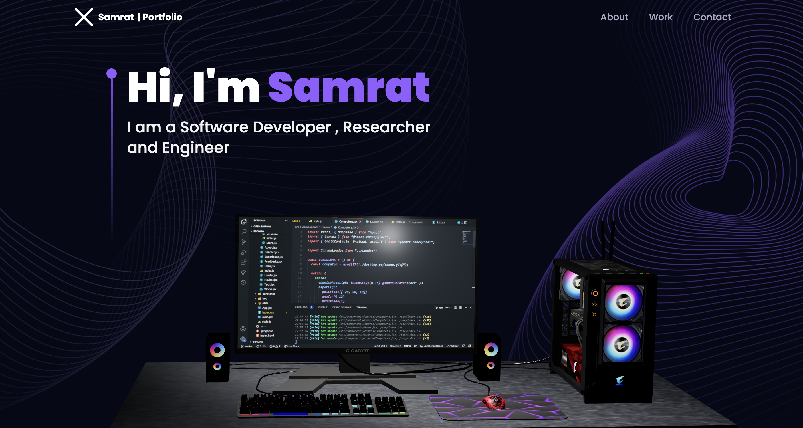
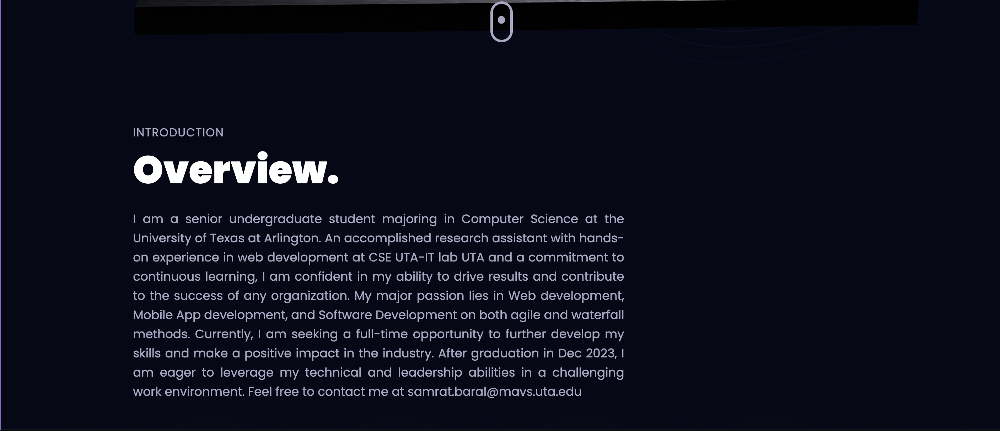
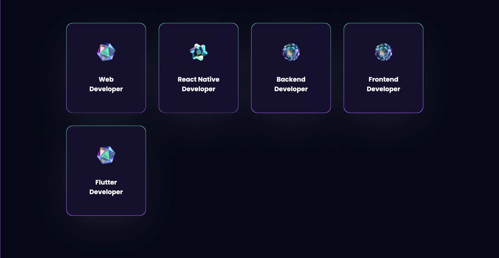
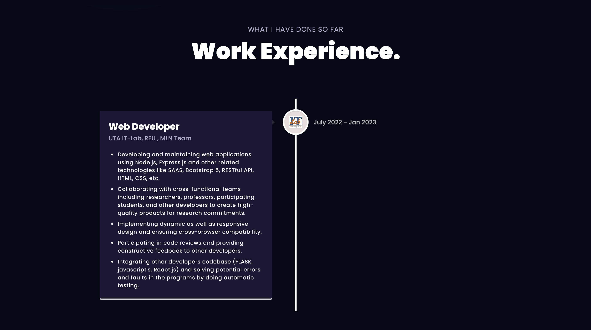
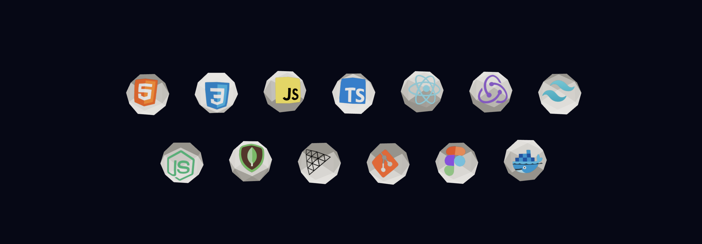
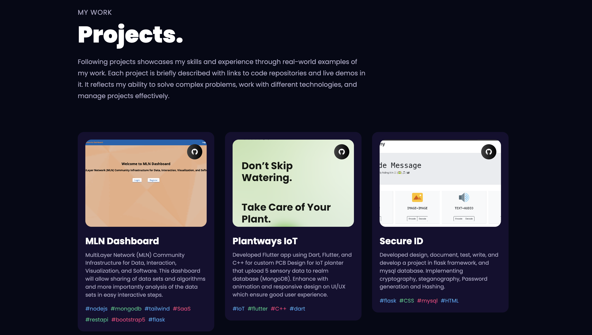
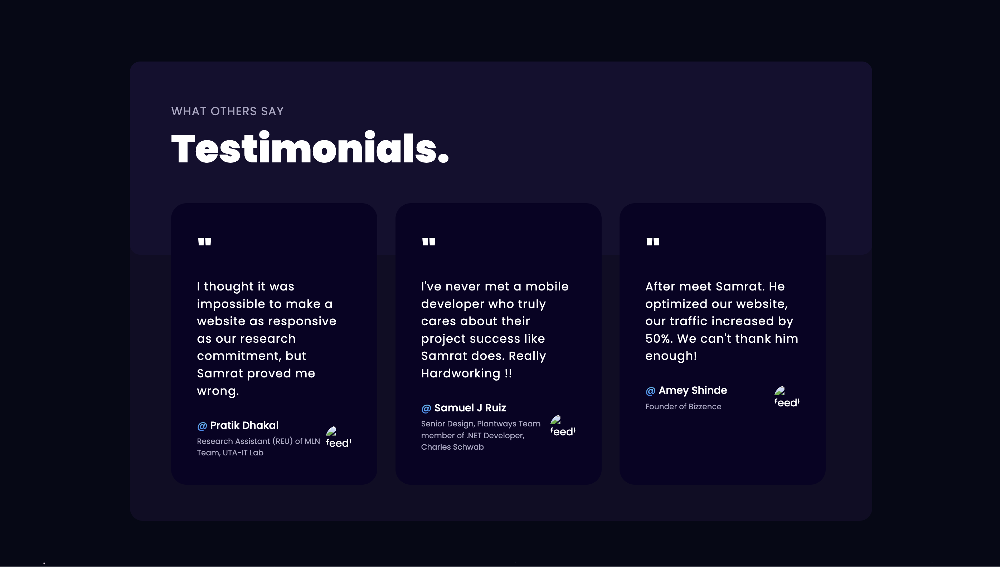
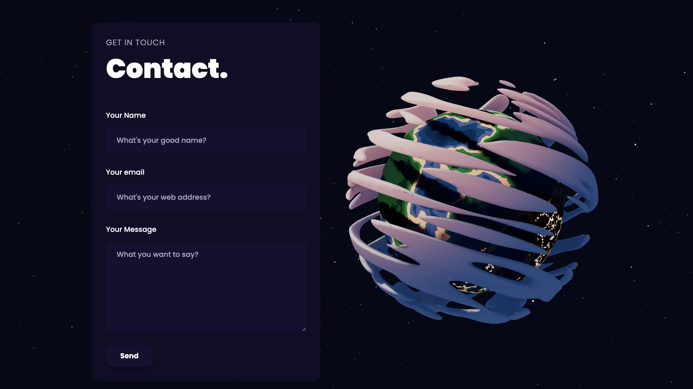
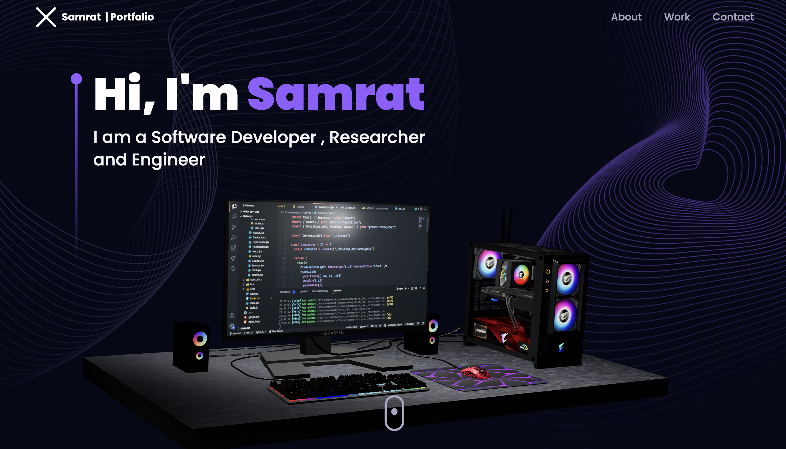

# Who am I?

| [Introduction](./public/demo/1.png "Intro") |
[Overview](./public/demo/2.png "Overview") |
[Developer](./public/demo/3.png "Developer") |
[Work Experience](./public/demo/4.png "Work Experience") |
[Technology](./public/demo/5.png "Technology") |
[Projects and Work](./public/demo/6.png "Projects and Work") |
[Testimonials](./public/demo/7.png "Testimonials") |
[Contact](./public/demo/8.png "Contact") |

# How to Create Own Portfolio

### [ INSTALLATION ](./README.md), [ CREDIT ](./README.md), [LICENCE](./LICENCE)

